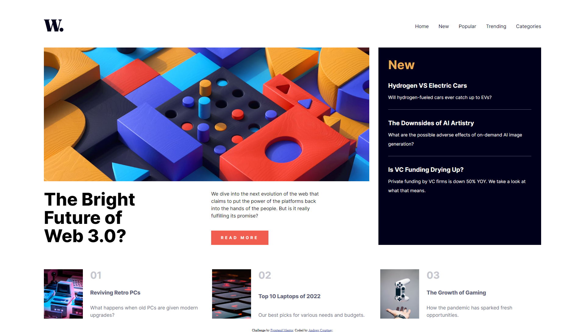

# Frontend Mentor - News homepage solution

This is a solution to the [News homepage challenge on Frontend Mentor](https://www.frontendmentor.io/challenges/news-homepage-H6SWTa1MFl). Frontend Mentor challenges help you improve your coding skills by building realistic projects. 

## Table of contents

- [Overview](#overview)
  - [The challenge](#the-challenge)
  - [Screenshot](#screenshot)
  - [Links](#links)
- [My process](#my-process)
  - [Built with](#built-with)
  - [What I learned](#what-i-learned)
  - [Continued development](#continued-development)
  - [Useful resources](#useful-resources)
- [Author](#author)

## Overview

### The challenge

Users should be able to:

- View the optimal layout for the interface depending on their device's screen size
- See hover and focus states for all interactive elements on the page

### Screenshot

### Links

- Solution URL: (http://newshomepage.andrewcourtney.co.uk/)
- Live Site URL: (http://newshomepage.andrewcourtney.co.uk/)

## My process

### Built with

- Semantic HTML5 markup
- CSS custom properties
- Flexbox
- CSS Grid
- Mobile-first workflow

### What I learned

Through developing this solution, I was given freedom to experiment with a layout which required a full CSS Grid layout, while also gaining confidence in efficient use of Flexbox as required. I developed my skills further using a BEM approach to site development, with well-documented code throughout. The project provided me with an opportunity to build a relatively complex responsive layout, with a mobile-first consideration taken at every step.

### Continued development

I would like to use this project as a basis for developing my skillset further within CSS Grid and general layout builds, while also furthering my understanding of how best to build user interface elements and interaction with CSS & JavaScript in general.

### Useful resources

- [MDN Docs](https://developer.mozilla.org/en-US/) - Furthered my understanding of how to build CSS Grid layouts, while also assisting with transforming my previous jQuery-based mobile menu into a vanilla JavaScript example.

## Author

- Website - [Andrew Courtney](https://www.andrewcourtney.co.uk)
- Frontend Mentor - [@yourusername](https://www.frontendmentor.io/profile/yourusername)